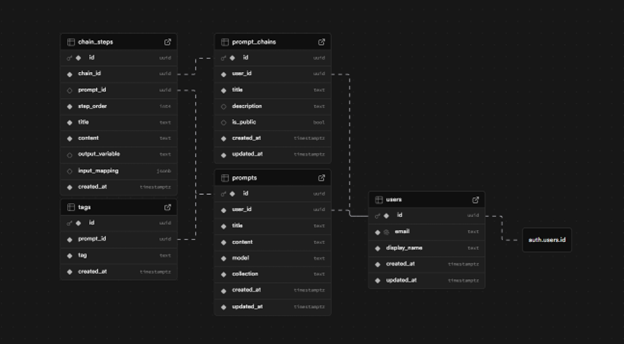

# 🗒️ closedNote

> *"Because even ChatGPT forgets sometimes..."*

[](https://vercel.com/new/clone?repository-url=https://github.com/aboderinsamuel/closedNote)

---

## 👋 What is closedNote?

closedNote is a simple web app for saving, organizing, and re-using your best prompts, built for students, teachers, engineers, prompt engineers, prompt tutors, and even parents like my mum 😅.

It's the one place you can finally dump all your fire prompts without digging through old chats or screenshots. A calm home for all your creativity.

---

## 💡 The Story

I got tired of re-engineering my "perfect ChatGPT prompts" every time I needed a particular kind of answer. Then my mum started doing the same thing (don't ask how she got into it 😭). Then my grandma. Then my classmates.

Meanwhile, prompt engineers were dropping crazy tips on X (Twitter) and Stack Overflow, but I had nowhere to store them neatly.

So, I built one. That's what closedNote is all about, a small home to make prompt saving easier for everyone. 🙂🙂

Completely open source, open to contributions, and continuously improving.

---

## 🖥️ Demo

### Dashboard


### Prompt Editor


> clean, minimal, distraction-free — because prompts deserve peace too 😌

### Image to Text (OCR)


> Upload a screenshot, get the text out. No retyping. Ever.

### 📱 Mobile

|                                                   |                                                   |
| ------------------------------------------------- | ------------------------------------------------- |
|  |  |

> Fully responsive. Works on the go.

---

## 🏗️ Architecture

```
User Browser
    │
    ├── Next.js 14 App Router (client-side pages)
    │       ├── / .............. Dashboard (prompt list + search + collections)
    │       ├── /prompts/[id] .. View / Edit a prompt
    │       ├── /ocr ........... Image → Text → Refine → Save
    │       ├── /settings ...... API keys, theme, account
    │       └── /home .......... Marketing landing page
    │
    ├── API Routes (server-side, Next.js edge)
    │       ├── /api/ocr ....... Vision OCR (OpenAI GPT-4o-mini if user key provided)
    │       └── /api/chat ...... AI text refinement (OpenAI or HuggingFace user key)
    │
    ├── Supabase (PostgreSQL + Auth)
    │       ├── Auth: PKCE flow, email/password
    │       ├── Tables: users · prompts · (RLS on everything)
    │       └── RPC: delete_user()
    │
    └── Tesseract.js (offline OCR fallback, runs in browser, no API needed)
```

**AI Provider Chain:**
- OCR: `OpenAI GPT-4o-mini (user key)` → `Tesseract.js (offline fallback)`
- Refinement: `OpenAI (user key)` → `HuggingFace Zephyr (user key)` → error with Settings link

Users without API keys still get full prompt management + offline OCR. AI features unlock when they add a key in Settings.

### 🗄️ Database Schema



Every user's data is tied to their `auth.uid()`. No mix-ups, no leaks. Row Level Security enforced on every table.

---

## 🧠 Features

- 🔍 **Instant Search** — command palette (`⌘K`) across all prompts and pages
- 📁 **Collections** — group prompts by topic, project, or vibe
- 🖼️ **Image to Text (OCR)** — upload screenshots → extract text → save as prompt
- ✨ **AI Refinement** — clean up extracted text into a polished, reusable prompt
- 💾 **One-Click Copy** — paste straight into ChatGPT, Claude, Cursor, whatever
- 🌗 **Dark Mode** — because your eyes matter
- 📱 **Fully Responsive** — works on mobile without crying
- 🔒 **Private by Default** — RLS ensures your data stays yours
- ⚡ **Instant UI Updates** — add, edit, delete — no page refresh needed

---

## ⚙️ Tech Stack

<div align="center">

| Frontend | Backend | AI/OCR | Database | Deployment |
|:--------:|:-------:|:------:|:--------:|:----------:|
| <br/>**Next.js 14** | <br/>**Supabase** | <br/>**OpenAI** | <br/>**PostgreSQL** | <br/>**Vercel** |
| <br/>**React 18** | PKCE Auth | GPT-4o-mini Vision | RLS Policies | Auto Deploy |
| <br/>**TypeScript** | API Routes | HuggingFace Zephyr | Real-time Sync | Preview URLs |
| <br/>**Tailwind CSS** | Edge Functions | Tesseract.js (offline) | Migrations | CDN |

</div>

---

## 🧪 Run Locally

```bash
git clone https://github.com/aboderinsamuel/closedNote.git
cd closedNote
npm install
cp .env.example .env.local
# Fill in your Supabase keys in .env.local
npm run dev
```

Visit 👉 **[http://localhost:3000](http://localhost:3000)**

**.env.local variables:**

```env
NEXT_PUBLIC_SUPABASE_URL=your_supabase_url
NEXT_PUBLIC_SUPABASE_ANON_KEY=your_supabase_anon_key
```

**AI features (optional):**

Users can add their own API keys in the Settings page — no server key needed:
- **OpenAI key** → unlocks AI-powered OCR (GPT-4o-mini vision) + AI refinement
- **HuggingFace key** → unlocks AI refinement (Zephyr-7b)
- **No key** → OCR still works via Tesseract.js (offline, in-browser)

---

## 🚀 Deploy to Production

#### Vercel (Recommended)

1. Fork this repo
2. Import to [Vercel](https://vercel.com)
3. Add environment variables:
   - `NEXT_PUBLIC_SUPABASE_URL`
   - `NEXT_PUBLIC_SUPABASE_ANON_KEY`
4. Deploy

**After Deployment:**
- Go to Supabase Dashboard → Authentication → URL Configuration
- Add your Vercel domain to **Redirect URLs**: `https://your-app.vercel.app/**`
- Update **Site URL** to: `https://your-app.vercel.app`

---

## 🔒 Security

- ✅ Row Level Security (RLS) on all tables
- ✅ Auth via Supabase (PKCE + JWT)
- ✅ User API keys stored in `localStorage` only — never persisted server-side
- ✅ `.env.local` excluded from Git
- ✅ HTTPS enforced on Vercel

---

## 🧑🏽‍💻 Contributing

closedNote is **completely open source** and open to contributions.
The goal is to make prompt saving easier for *everyone*, not just developers.

Got ideas? Dark mode themes, AI tag suggestions, team sharing, prompt history — hop in!

```bash
1. Fork this repo 🍴
2. Create a branch (feature/my-new-idea)
3. Commit & push
4. Open a pull request 🚀
```

---

## 👨🏽‍🎓 About

Built by [**Samuel Aboderin**](https://github.com/aboderinsamuel),
Computer Engineering student at **UNILAG 🇳🇬**,
who got tired of losing his prompts and decided to fix it for everyone else too.

[LinkedIn](https://www.linkedin.com/in/samuelaboderin) · [GitHub](https://github.com/aboderinsamuel)

---

## 🧾 License

MIT -
 use it, remix it, improve it. Just don't lock it behind a paywall. 🙏🏽

---

*closedNote - because your prompts deserve better than browser history.* ✨
