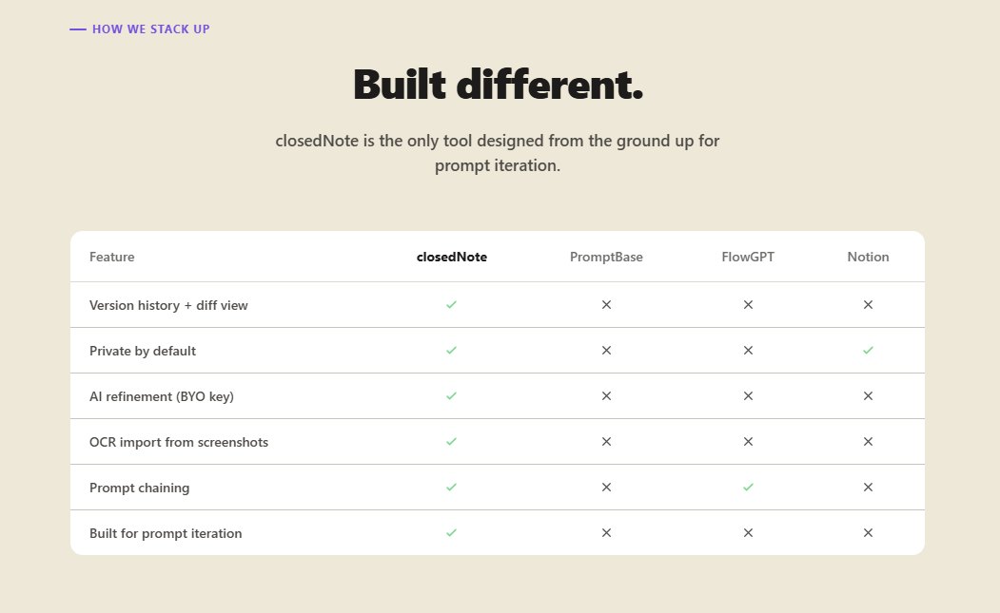
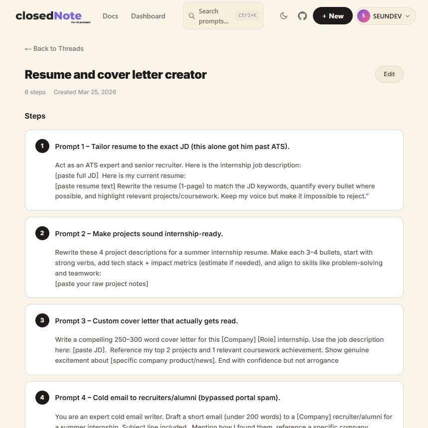
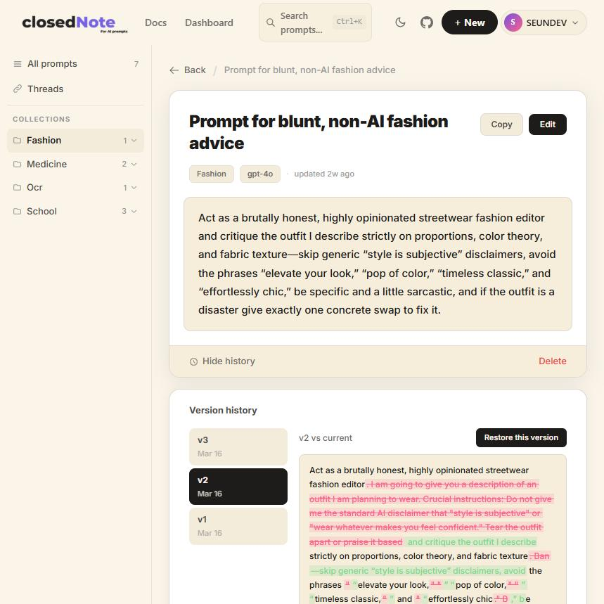
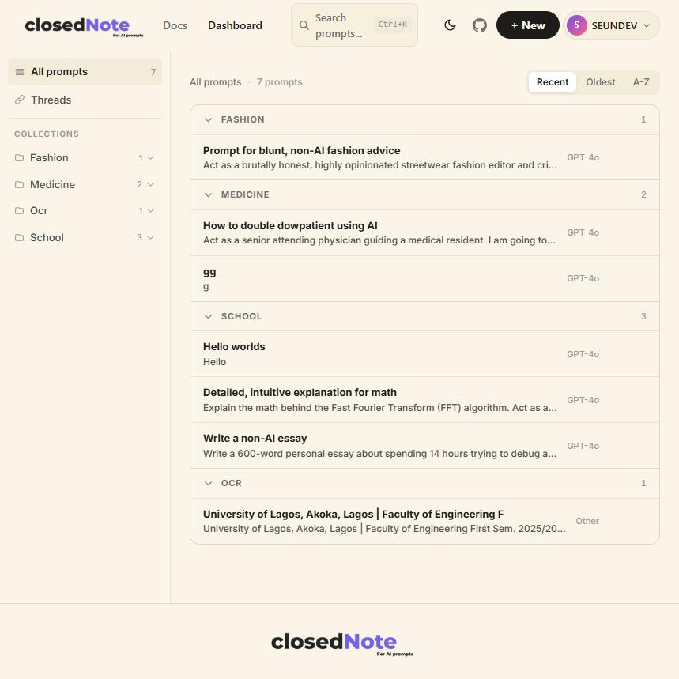
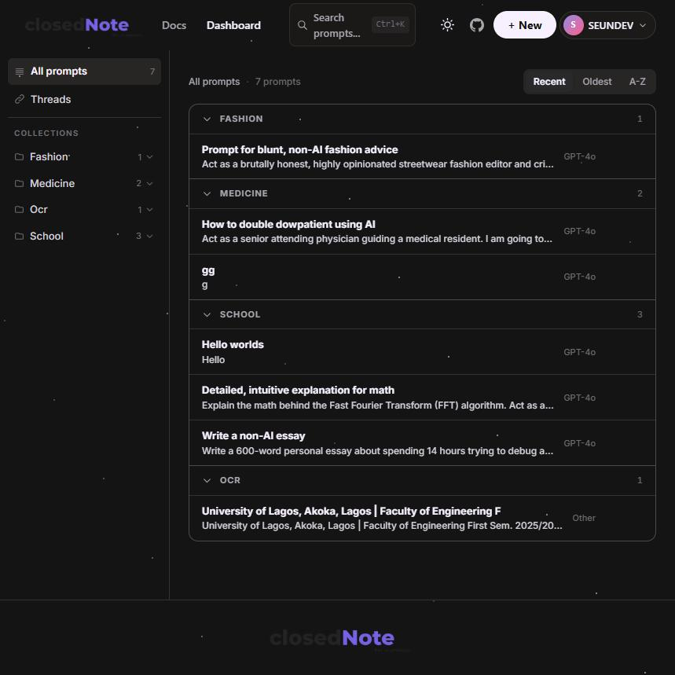
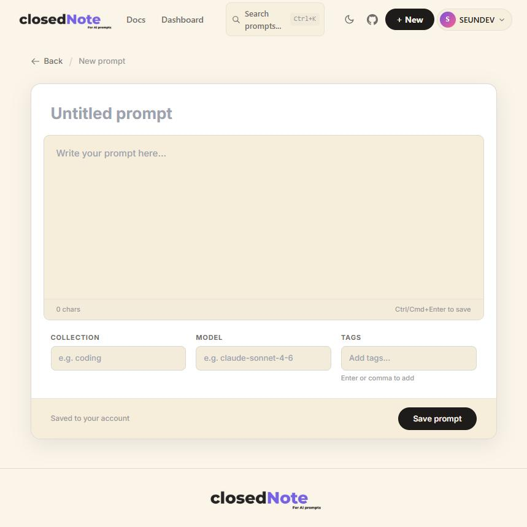
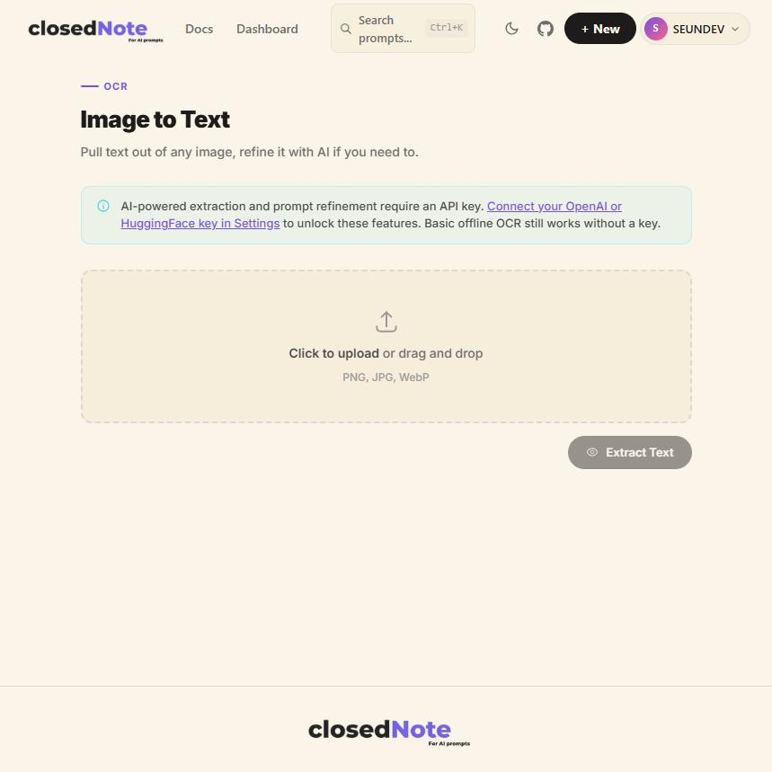
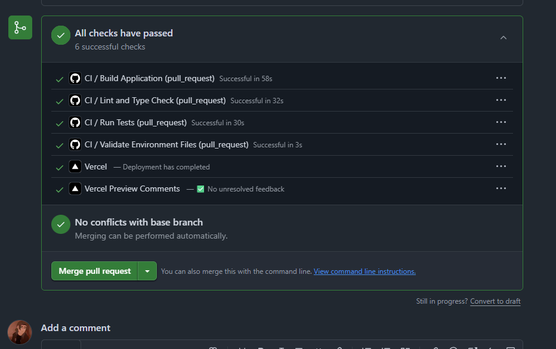

<p align="center">
  
</p>

# closedNote

> **Prompts are living documents. closedNote is the only prompt manager that remembers how they evolved.**
<h3 align="center">
  <a href="https://closednote.vercel.app">👉 Live at closednote.vercel.app</a>
</h3>
[](https://nextjs.org)
[](https://www.typescriptlang.org)
[](https://supabase.com)
[](LICENSE)
[](https://vercel.com)

**📊 Project Scope: 13 API Routes · 17 React Components · 25 Passing Tests**

---

## 🧠 The Story

I got tired of re-engineering my "perfect ChatGPT prompts" every time I needed a particular kind of answer. Then my mum started doing the same thing. Then my grandma. Then my classmates.

Meanwhile, prompt engineers were dropping tips on X and Stack Overflow, but nobody had a good place to store, iterate on, and *remember* them.

So I built one, and added version control, because the best prompt you'll ever write is usually the fourth draft of something you thought was broken.

Beyond versioning, closedNote adds structure: organize into collections, chain into multi-step workflows, refine with AI, and import from any image via OCR, all private by default.

---

## ⚖️ How We Compare

<p align="center">
  
</p>

---

## 🏗️ Architecture & Fault Tolerance

closedNote is a full-stack **Next.js 14** application backed by **Supabase (PostgreSQL + Auth)**. The core architectural goal is simple: **every feature that matters (writing, versioning, change tracking, searching, chaining) must feel instant, safe, and impossible to lose**.

### Versioning and Change Tracking (Core System)

- **Automatic version snapshots** are created only when content actually changes (no noisy duplicates).
- Every version is **comparable and restorable**, so you can experiment freely without fear of losing a working draft.

### Prompt Threads (Multi-step Workflows)

- **Threads** model prompts as ordered steps where each step can be refined independently.
- Each step has its **own version history**, so workflows evolve without breaking the whole chain.

### Search & Navigation (Fast Retrieval)

- A global **command palette (`⌘K` / `Ctrl+K`)** provides fast navigation across prompts, collections, and threads.
- Search is designed to keep your library usable even as it scales.

### Privacy and Security by Design

- **Supabase Row-Level Security (RLS)** enforces access control at the database layer.
- Every prompt, version, collection, and thread is strictly scoped to the authenticated user’s ID.

---

## ✨ Core Features

### 1. Prompt Threads (Chains)

This is closedNote's biggest differentiator. Instead of writing one massive, brittle prompt, you can break complex tasks into discrete, testable steps. Chain prompts into multi-step workflows where each output feeds the next.

<p align="center">
  
</p>

### 2. Version History (Git for Prompts)

Every edit is automatically snapshotted. Powered by Google's `diff-match-patch` algorithm, you get a visual, character-level diff of what changed (additions in green, removals in red) and one-click restoration without losing your timeline.

<p align="center">
  
</p>

### 3. AI Refinement & Organization

Turn rough ideas into structured prompts using your own API keys. Group prompts into Collections, and instantly search your entire library via the `⌘K` command palette.

---

## ✅ All Features

- **Version History** - track every draft with a visual diff and one-click restore  
- **Prompt Threads** - link prompts into multi-step workflows where each output feeds the next  
- **OCR Import** - upload a screenshot or photo, extract the text, save it as a prompt  
- **Instant Search** - command palette (`⌘K`) across your entire library  
- **Collections** - group prompts by topic, project, or use case  
- **AI Refinement** - clean up rough ideas into polished, reusable prompts using your own API key  
- **One-Click Copy** - paste straight into ChatGPT, Claude, Cursor, or wherever you work  
- **Private by Default** - row-level security ensures your data is never accessible to others  
- **Dark Mode** - full theme support, system-aware  
- **Fully Responsive** - works on mobile without crying  

---

## 🎬 Demo

### Dashboard

|  |  |
|--|--|
|  |  |

### Prompt Editor

<p align="center">
  
</p>

### Image to Text (OCR)

<p align="center">
  
</p>

---

## 🧱 Tech Stack

| Layer | Technology |
|---|---|
| Frontend | Next.js 14 (App Router) · React 18 · TypeScript 5.5 · Tailwind CSS 3.4 |
| Backend | Supabase (PostgreSQL + PKCE Auth + Row-Level Security) · Next.js API Routes |
| AI / OCR | OpenAI GPT-4o-mini · HuggingFace Zephyr-7b · Tesseract.js (offline fallback) |
| Diff Engine | Google diff-match-patch |
| Deployment | Vercel |

Users without API keys get full prompt management + offline OCR. AI features unlock when they add their own key in Settings.

---

## 🧪 Tests

All tests passing across authentication logic and UI components, including build, lint, type check, and environment validation, verified by CI/CD pipeline with Vercel deployment.



---

## ⚡ Run Locally

```bash
git clone https://github.com/aboderinsamuel/closedNote.git
cd closedNote
npm install
cp .env.example .env.local
# Fill in your Supabase keys
npm run dev
```

**.env.local:**
```env
NEXT_PUBLIC_SUPABASE_URL=your_supabase_url
NEXT_PUBLIC_SUPABASE_ANON_KEY=your_supabase_anon_key
```

**Supabase setup:** run the four migration files in [`/supabase/migrations`](./supabase/migrations) in order inside the Supabase SQL editor.

---

## 🚀 Deploy

1. Fork this repo
2. Import to [Vercel](https://vercel.com) and add the two env vars above
3. In Supabase → Authentication → URL Configuration, add your Vercel domain to Redirect URLs

---

## 🤝 Contributing

Got ideas? Contributions welcome.

1. Fork this repo
2. Create a branch: `git checkout -b feature/your-idea`
3. Commit and push
4. Open a pull request

See [open issues](https://github.com/aboderinsamuel/closedNote/issues) for what's being worked on.

---

## 👤 Built by

**Samuel Aboderin**, Computer Engineering, UNILAG 🇳🇬

[](https://github.com/aboderinsamuel)
[](https://www.linkedin.com/in/samuelaboderin)

---

## License

MIT, use it, remix it, improve it.

---

*closedNote, because your prompts deserve better than browser history.*
