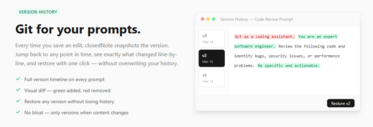
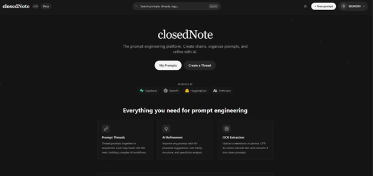
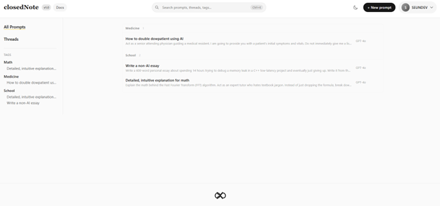
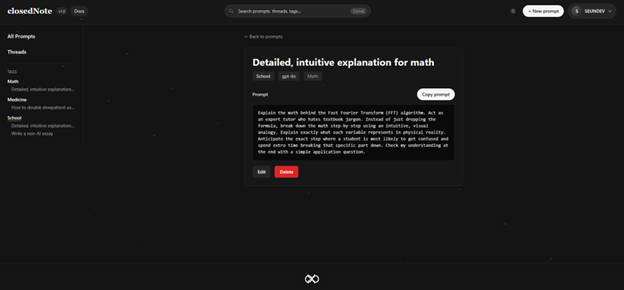
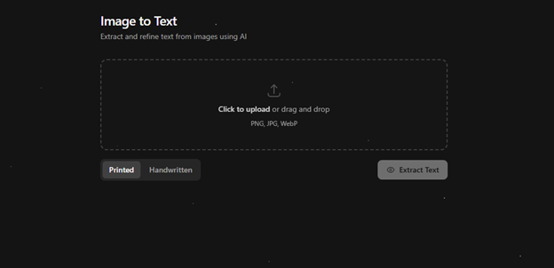
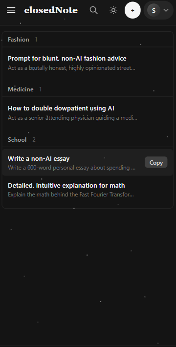
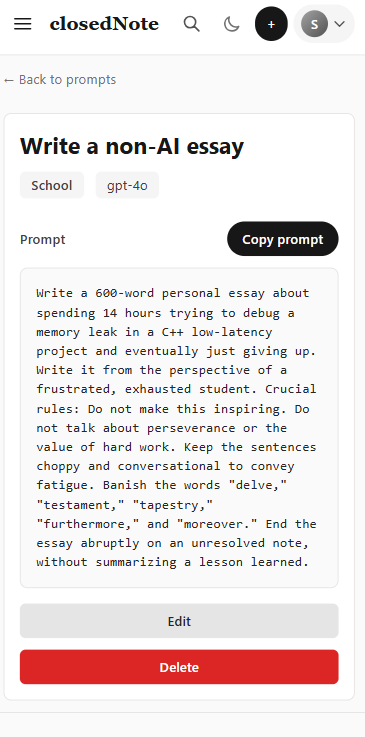
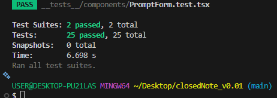

# closedNote

> **Prompts are living documents. closedNote is the only prompt manager that remembers how they evolved.**

[](https://closednote.vercel.app)
[](https://nextjs.org)
[](https://www.typescriptlang.org)
[](https://supabase.com)
[](LICENSE)
[](https://vercel.com)

---

## Explanation

PromptBase stores prompts. Notion organizes them. FlowGPT shares them. None of them remember how they got there.

In real life, prompts evolve. You tweak your "code review prompt" three times, and by the fourth iteration you've forgotten what made version 2 actually work. There is no tool aimed at everyday users that tracks how your prompts change over time, until now.

closedNote is built on one thesis: **a prompt is not a sticky note. It's a document with a history.**

Beyond versioning, closedNote adds structure: organize into collections, chain into multi-step workflows, refine with AI, and import from any image via OCR, all private by default.

---

## Version History, git for your prompts

Every time you save an edit, closedNote snapshots the version. Jump back to any point in time, see exactly what changed line by line, and restore with one click, without overwriting your history.



- Full version timeline on every prompt
- Visual diff, additions in green, removals in red
- Restore any version without losing the history chain
- Versions only created when content actually changes, no noise

---

## All Features

- **Version History**, track every draft with a visual diff and one-click restore *(new)*
- **Instant Search**, command palette (`⌘K`) across your entire library
- **Collections**, group prompts by topic, project, or use case
- **AI Refinement**, clean up rough ideas into polished, reusable prompts using your own API key
- **OCR Import**, upload a screenshot or photo, extract the text, save it as a prompt
- **Prompt Chains**, link prompts into multi-step workflows where each output feeds the next
- **One-Click Copy**, paste straight into ChatGPT, Claude, Cursor, or wherever you work
- **Private by Default**, row-level security ensures your data is never accessible to others
- **Dark Mode**, full theme support, system-aware
- **Fully Responsive**, works on mobile without crying

---

## Demo

### Dashboard





### Prompt Editor



### Image to Text (OCR)



### Mobile

|  |  |
|---|---|
|  |  |

---

## Tech Stack

| Layer | Technology |
|---|---|
| Frontend | Next.js 14 (App Router) · React 18 · TypeScript 5.5 · Tailwind CSS 3.4 |
| Backend | Supabase (PostgreSQL + PKCE Auth + Row-Level Security) · Next.js API Routes |
| AI / OCR | OpenAI GPT-4o-mini · HuggingFace Zephyr-7b · Tesseract.js (offline fallback) |
| Diff Engine | Google diff-match-patch |
| Deployment | Vercel |

Users without API keys get full prompt management + offline OCR. AI features unlock when they add their own key in Settings.

---

## Tests



25 tests passing across auth logic and UI components.

```bash
npm test
```

---

## The Story

I got tired of re-engineering my "perfect ChatGPT prompts" every time I needed a particular kind of answer. Then my mum started doing the same thing. Then my grandma. Then my classmates.

Meanwhile, prompt engineers were dropping tips on X and Stack Overflow, but nobody had a good place to store, iterate on, and *remember* them.

So I built one, and added version control, because the best prompt you'll ever write is usually the fourth draft of something you thought was broken.

---

## Run Locally

```bash
git clone https://github.com/aboderinsamuel/closedNote.git
cd closedNote
npm install
cp .env.example .env.local
# Fill in your Supabase keys
npm run dev
```

**.env.local:**
```env
NEXT_PUBLIC_SUPABASE_URL=your_supabase_url
NEXT_PUBLIC_SUPABASE_ANON_KEY=your_supabase_anon_key
```

**Supabase setup:** run the four migration files in [`/supabase/migrations`](./supabase/migrations) in order inside the Supabase SQL editor.

---

## Deploy

1. Fork this repo
2. Import to [Vercel](https://vercel.com) and add the two env vars above
3. In Supabase → Authentication → URL Configuration, add your Vercel domain to Redirect URLs

---

## Contributing

Got ideas? Contributions welcome.

1. Fork this repo
2. Create a branch: `git checkout -b feature/your-idea`
3. Commit and push
4. Open a pull request

See [open issues](https://github.com/aboderinsamuel/closedNote/issues) for what's being worked on.

---

## Built by

**Samuel Aboderin**, Computer Engineering, UNILAG 🇳🇬

[](https://github.com/aboderinsamuel)
[](https://www.linkedin.com/in/samuelaboderin)

---

## License

MIT, use it, remix it, improve it.

---

*closedNote, because your prompts deserve better than browser history.*
